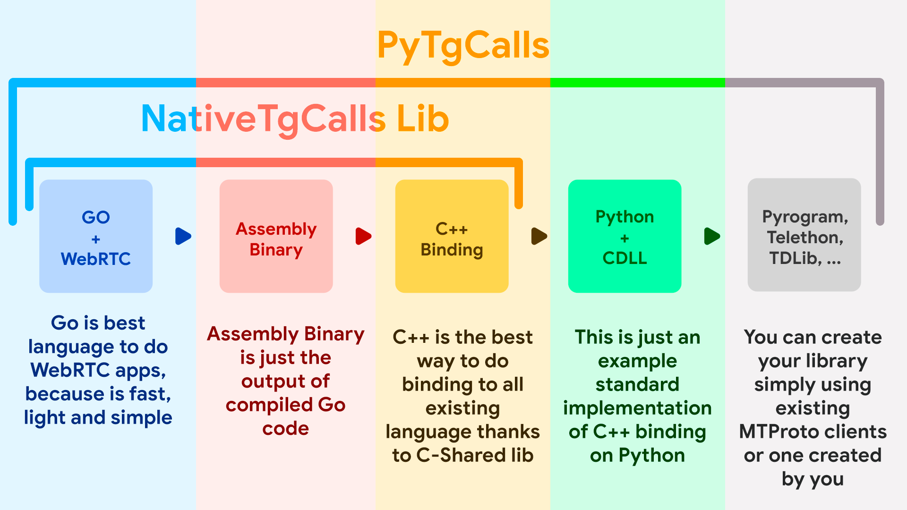

<p align="center">
  
</p>

# NativeTgCalls
This project allows you to simplify Telegram voice calls through the use of WebRTC and GO

## Why we use GO instead of C++ or just NodeJs?
#### 1) GO is simple programming language and low-level
#### 2) GO when compiled the result is just Assembly, and don't is emulated like NodeJS
#### 3) This version support Windows, Android, iOS, Linux and more
#### 4) The CPU usage is very low, 90% less than NodeJS

## How to use it?
Just before compile the Go part
``` bash
cd dist/
go build -o ntgcalls.so -buildmode=c-shared .
```
Then specify the client configuration, and the chat id in test.py, after this run the test.py
``` bash
python3.8 test.py
```

## What type of stream is needed?
The same type of stable [pytgcalls]

## It's working?
Nop, actually, not working, but [any type of help] is accepted, the problem is "Not transmitting the voice of audio file"

[pytgcalls]: https://github.com/pytgcalls/pytgcalls
[any type of help]: https://github.com/pion/mediadevices/issues/339